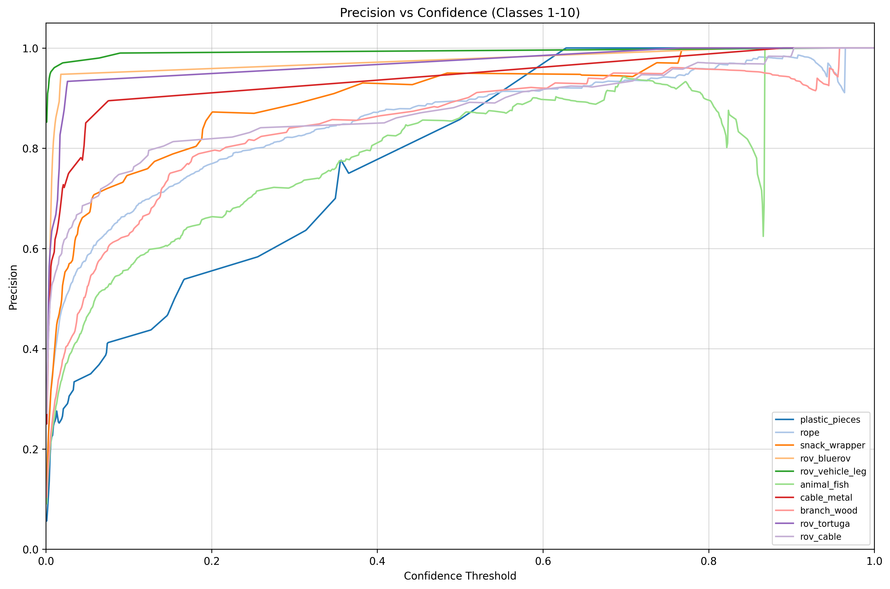
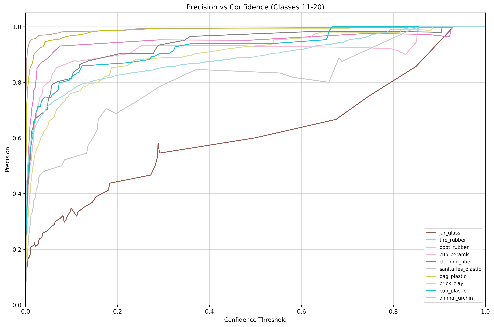
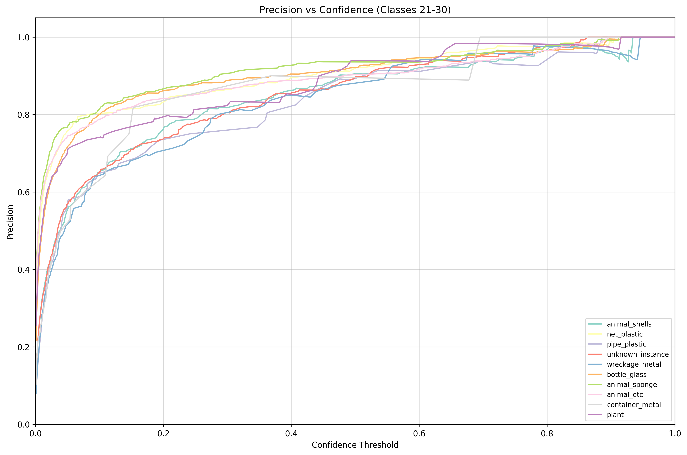
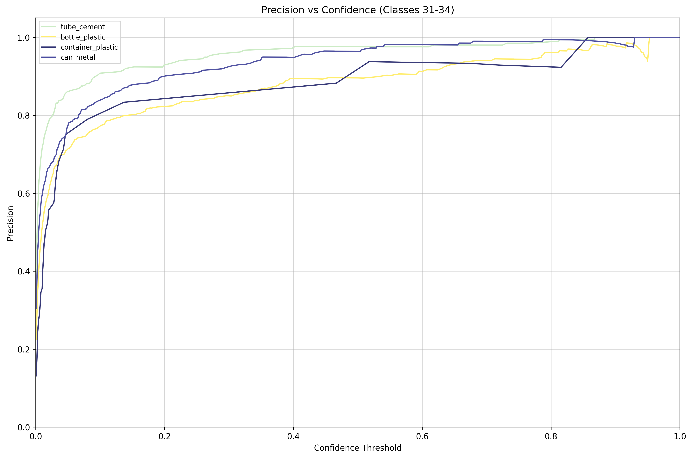
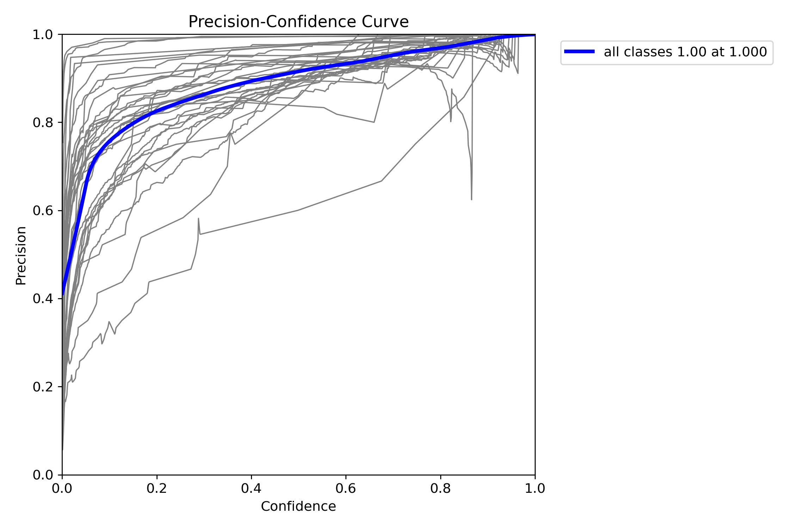

# coloredcurves4yolo

Extract reusable artifacts from Ultralytics YOLO validation runs:

- `ultralytics_native_outputs`
- `metrics_for_custom_plots`
- `colorful_illustrative_curves`

This repository is a clean, open-source extraction of the curve-export workflow from a larger internal evaluation script. It preserves Ultralytics native validation plots and reports while also exporting custom NumPy metric arrays and grouped colorful curve figures.

## Features

- Export `P.npy`, `R.npy`, `F1.npy`, and `confidence.npy`
- Generate grouped colorful Precision / Recall / F1 / PR curve figures
- Preserve Ultralytics native validation plots and reports
- Support single-model and multi-model evaluation
- Keep outputs organized per model

## Installation

```bash
pip install -e .
```

Or install dependencies directly:

```bash
pip install ultralytics matplotlib numpy PyYAML
```

## Quick Start

Run directly from the repository root:

```bash
python coloredcurves4yolo.py \
  --model path/to/best.pt \
  --data path/to/dataset.yaml \
  --output outputs
```

If you install the package, you can also use:

```bash
coloredcurves4yolo \
  --model path/to/best.pt \
  --data path/to/dataset.yaml \
  --output outputs
```

## Multiple Models

```bash
coloredcurves4yolo \
  --weights-glob "weights/*.pt" \
  --data path/to/dataset.yaml \
  --output outputs
```

For a single model, `outputs/` contains:

```text
outputs/
├── ultralytics_native_outputs/
├── colorful_illustrative_curves/
└── metrics_for_custom_plots/
```

For multiple models, each model gets its own subdirectory:

```text
outputs/
├── model_a/
│   ├── ultralytics_native_outputs/
│   ├── colorful_illustrative_curves/
│   └── metrics_for_custom_plots/
└── model_b/
    ├── ultralytics_native_outputs/
    ├── colorful_illustrative_curves/
    └── metrics_for_custom_plots/
```

## Example Comparison

Below is a real `imgsz=960` validation example that compares the custom grouped
`Precision vs Confidence` plots with the native Ultralytics `BoxP_curve`.

Custom grouped `Precision vs Confidence` examples:






Native Ultralytics comparison:



## CLI Options

```text
--model         Repeatable path to a model file
--weights-glob  Glob pattern for model discovery, for example "weights/*.pt"
--data          Dataset YAML path
--output        Output directory
--split         Dataset split, default: val
--imgsz         Validation image size, default: 640
--batch         Validation batch size, default: 16
--device        auto, cpu, cuda, cuda:0, 0, ...
--chunk-size    Number of classes per figure, default: 10
--dpi           Figure dpi, default: 300
```

## Notes

- The exporter depends on Ultralytics exposing `results.box.p_curve`, `results.box.r_curve`, `results.box.f1_curve`, and optionally `results.box.px`.
- If your Ultralytics version changes those attributes, the export step may need a small compatibility update.
- This repository is licensed under AGPL-3.0. If you deploy a modified version as a network service, AGPL obligations apply.
